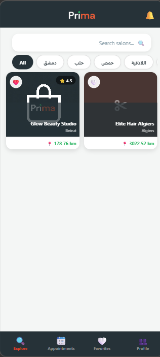
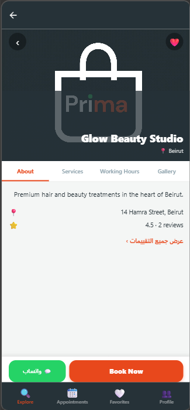
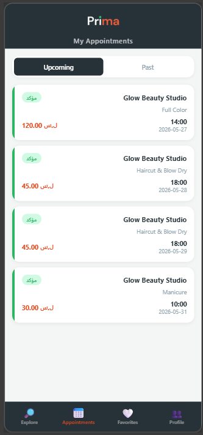
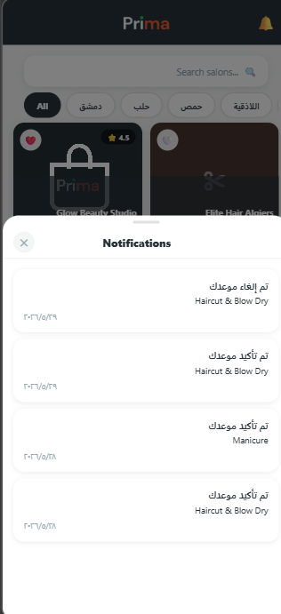
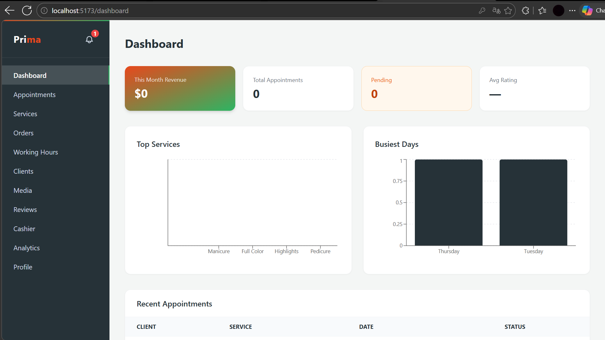
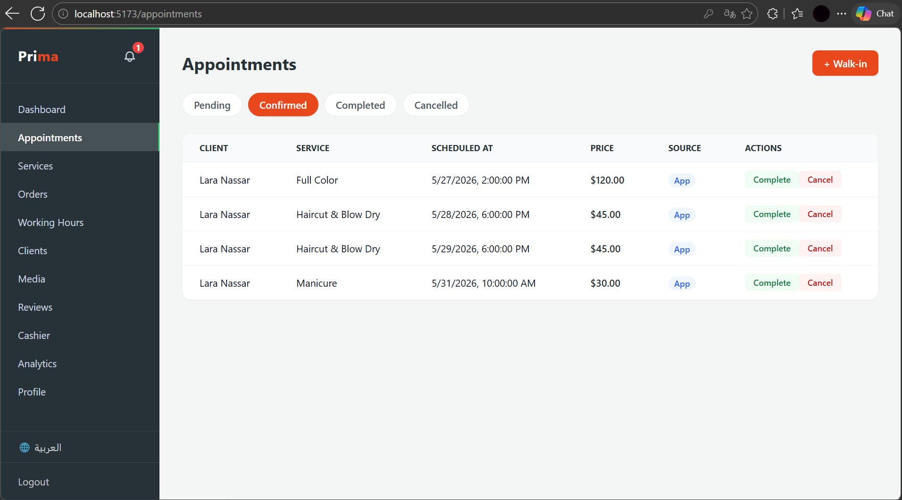
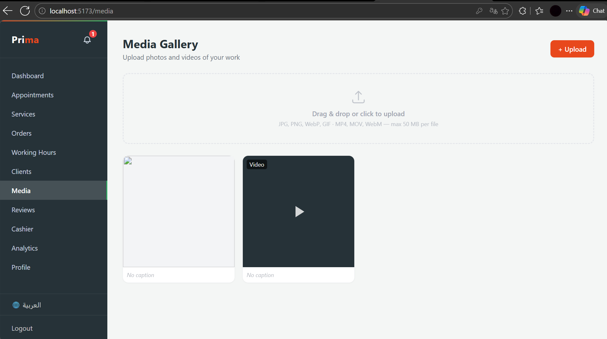
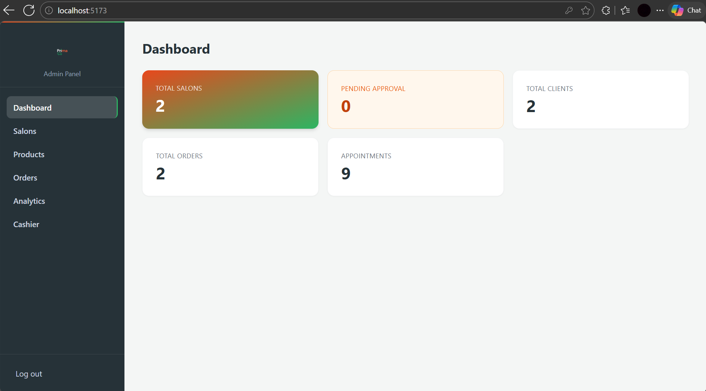
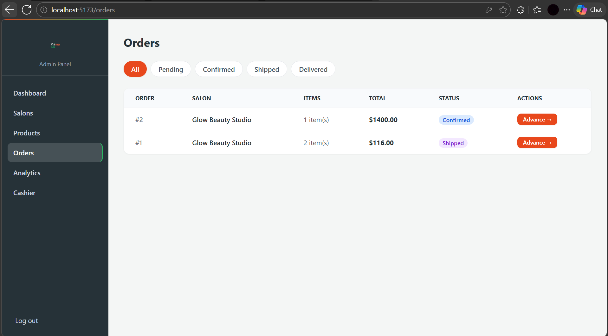

# Prima — Salon Marketplace Platform

**Prima** is a full-stack, multi-role marketplace that connects clients with beauty salons. It consists of three independent frontends backed by a single REST API.

---

## The Three Panels

| Panel | Stack | Role |
|---|---|---|
| **Client Mobile App** | React Native · Expo SDK 54 | Clients browse salons, book appointments, get push notifications |
| **Salon Web Dashboard** | React · Vite · Tailwind CSS | Salon owners manage appointments, media, services, and analytics |
| **Admin Web Panel** | React · Vite · Tailwind CSS | Platform admins approve salons, manage products, advance orders |
| **Backend API** | Laravel 11 · PHP 8.3 | Shared REST API with Sanctum auth, role-based access, queued notifications |

---

## Screenshots

### Client Mobile App

<table>
  <tr>
    <td align="center"><br/><sub>Explore</sub></td>
    <td align="center"><br/><sub>Salon Detail</sub></td>
    <td align="center"><br/><sub>My Appointments</sub></td>
    <td align="center"><br/><sub>Notifications</sub></td>
  </tr>
</table>

### Salon Web Dashboard

<table>
  <tr>
    <td align="center"><br/><sub>Dashboard</sub></td>
    <td align="center"><br/><sub>Appointments</sub></td>
  </tr>
  <tr>
    <td align="center" colspan="2"><br/><sub>Media Gallery</sub></td>
  </tr>
</table>

### Admin Panel

<table>
  <tr>
    <td align="center"><br/><sub>Dashboard</sub></td>
    <td align="center"><br/><sub>Orders</sub></td>
  </tr>
</table>

---

## Key Features

**Client App**
- Browse and search salons by city
- View salon profile: services, gallery, working hours, reviews
- Book appointments with date/time slot selection
- Real-time push notifications for booking status changes
- Manage upcoming and past appointments
- Save favorite salons
- Arabic / English with full RTL support

**Salon Dashboard**
- Appointment management with one-click confirm / complete / cancel
- Walk-in appointment creation
- Media gallery — upload photos and videos of work
- Service and pricing management
- Working hours configuration
- Revenue analytics and busiest-day charts
- Client list and reviews
- In-app notification bell with unread count

**Admin Panel**
- Approve / reject salon registrations
- Product catalogue and inventory management
- Order pipeline (Pending → Confirmed → Shipped → Delivered)
- Platform-wide analytics
- Cashier / POS interface

---

## Tech Stack

### Backend
- **Laravel 11** — REST API, role-based middleware, API Resources
- **Sanctum** — token-based auth for mobile and web clients
- **Laravel Notifications** — database + Expo Push Service channels
- **MySQL** — production database
- **Laravel Queues** — async notification dispatch

### Client Mobile
- **React Native** (Expo SDK 54, managed workflow)
- **Expo Notifications** — push notification registration and handling
- **Zustand** — global state (auth, favorites, notification count)
- **React Navigation** — bottom tabs + stack navigators
- **i18next** — Arabic / English with RTL layout support
- **expo-video-thumbnails** — video frame previews in salon gallery

### Salon & Admin Web
- **React 18** + **Vite**
- **Tailwind CSS** — utility-first styling with Prima brand tokens
- **i18next** — Arabic / English with RTL support
- **Recharts** — analytics charts
- **Axios** — API client with interceptors

---

## Repo Structure

```
prima/
├── backend/          # Laravel 11 API
├── client-mobile/    # React Native (Expo) client app
├── salon-web/        # React salon owner dashboard
├── admin-web/        # React admin panel
└── screenshots/      # App screenshots for this README
```

---

## Getting Started

### Prerequisites
- PHP 8.3+, Composer
- Node.js 18+
- MySQL (production) or SQLite (local dev)
- Expo CLI (`npm install -g expo-cli`)

### Backend

```bash
cd backend
cp .env.example .env
composer install
php artisan key:generate
php artisan migrate --seed
php artisan storage:link
php artisan serve
```

### Salon Web / Admin Web

```bash
cd salon-web   # or admin-web
cp .env.example .env
npm install
npm run dev
```

### Client Mobile

```bash
cd client-mobile
npm install
npx expo start
```

Scan the QR code with **Expo Go** (iOS/Android) or run on a simulator.

---

## Environment Variables

### Backend `.env` (key entries)
```
APP_URL=https://your-server.com
DB_CONNECTION=mysql
DB_DATABASE=prima
QUEUE_CONNECTION=database
```

### Client Mobile `src/api/constants.js`
```js
export const BASE_URL = 'https://your-server.com/api'
```

### Salon / Admin Web `.env`
```
VITE_API_URL=https://your-server.com/api
```

---

## API Overview

The backend exposes **58 routes** grouped by role:

| Prefix | Description |
|---|---|
| `/api/auth/*` | Register, login, push token, password reset |
| `/api/client/*` | Appointments, favorites, reviews, notifications |
| `/api/salon/*` | Dashboard, services, media, working hours, analytics |
| `/api/admin/*` | Salons, products, orders, cashier |

All protected routes require `Authorization: Bearer {token}`.

---

## Notification Flow

```
Client books appointment
        ↓
Backend dispatches AppointmentBooked (queued)
        ↓
Queue worker sends DB notification + Expo Push to salon owner
        ↓
Salon confirms / completes / cancels
        ↓
Backend dispatches AppointmentStatusChanged (queued)
        ↓
Queue worker sends DB notification + Expo Push to client
```

---

## Live Demo

| Panel | URL | Email | Password |
|---|---|---|---|
| Admin Panel | [glow-wbqw.vercel.app](https://glow-wbqw.vercel.app) | admin@glow.com | password |

---

## License

Private — all rights reserved.
