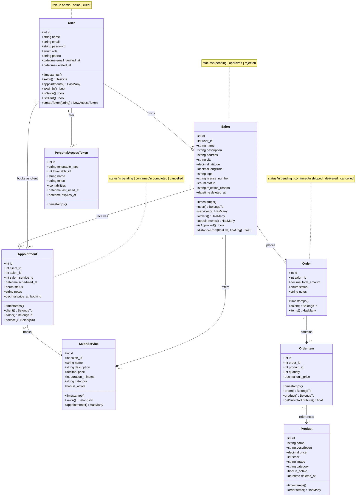

# GLOW — Class Diagram

---

## Relationships Legend

| Symbol | Meaning |
|--------|---------|
| `--*` | Composition (child cannot exist without parent) |
| `--o` | Aggregation (child can exist independently) |
| `-->` | Association (reference only) |

## Enum Values

| Model | Field | Values |
|-------|-------|--------|
| `User` | `role` | `admin` · `salon` · `client` |
| `Salon` | `status` | `pending` · `approved` · `rejected` |
| `Order` | `status` | `pending` · `confirmed` · `shipped` · `delivered` · `cancelled` |
| `Appointment` | `status` | `pending` · `confirmed` · `completed` · `cancelled` |

## Key Business Rules (enforced in controllers)

- A **Salon** must be `approved` before it can place Orders or receive Appointments
- A **SalonService** must be `is_active = true` to be bookable
- `OrderItem.unit_price` is snapshotted from `Product.price` at order time — price changes don't affect existing orders
- `Appointment.price_at_booking` is snapshotted from `SalonService.price` at booking time
- `Product.stock` is decremented atomically inside a DB transaction when an Order is placed
