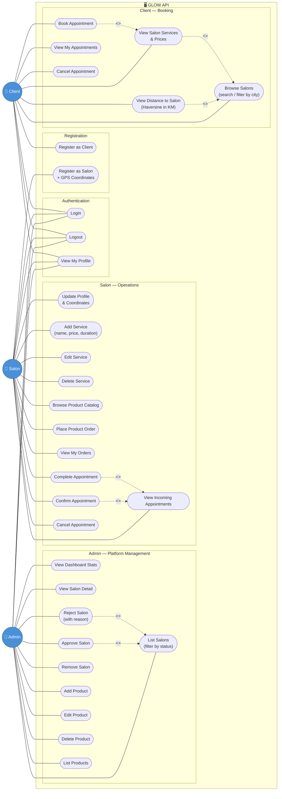

# GLOW — Use Case Diagram

---

## Summary Table

| Actor  | # Use Cases | Key Capabilities |
|--------|-------------|------------------|
| Admin  | 13 | Dashboard, salon verification, product catalog management |
| Salon  | 12 | Profile + GPS, services CRUD, product ordering, appointment management |
| Client | 7  | Browse salons, distance in KM, book & cancel appointments |
| **Total** | **32** | |

## API Endpoint Map

| Use Case | Method | Endpoint |
|---|---|---|
| Register Client | POST | `/api/auth/register/client` |
| Register Salon | POST | `/api/auth/register/salon` |
| Login | POST | `/api/auth/login` |
| Logout | POST | `/api/auth/logout` |
| My Profile | GET | `/api/auth/me` |
| Dashboard Stats | GET | `/api/admin/dashboard` |
| List Salons (admin) | GET | `/api/admin/salons?status=pending` |
| Approve Salon | PATCH | `/api/admin/salons/{id}/approve` |
| Reject Salon | PATCH | `/api/admin/salons/{id}/reject` |
| Delete Salon | DELETE | `/api/admin/salons/{id}` |
| Products CRUD | * | `/api/admin/products` |
| Salon Profile | GET/PUT | `/api/salon/profile` |
| Services CRUD | * | `/api/salon/services` |
| Place Order | POST | `/api/salon/orders` |
| Manage Appointments | PATCH | `/api/salon/appointments/{id}/confirm\|complete\|cancel` |
| Browse Salons + Distance | GET | `/api/client/salons?lat=&lng=&city=&search=` |
| View Salon Services | GET | `/api/client/salons/{id}` |
| Book Appointment | POST | `/api/client/appointments` |
| Cancel Appointment | PATCH | `/api/client/appointments/{id}/cancel` |
